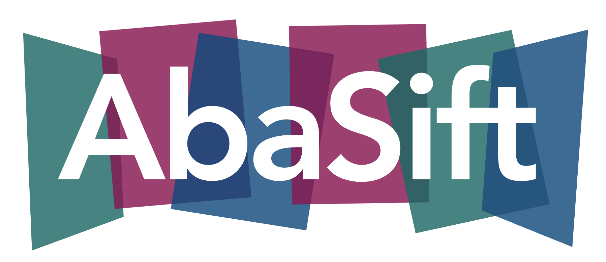

Distributed quality-control framework for egocentric vendor datasets on S3. A QC pipeline
is a DAG of kernels described in one YAML, and one YAML is one job on one machine.


## Quick start

```bash
bash setup.sh && conda activate abasift    # conda env `abasift`, package installed editable
pytest -m 'not s3'                         # 170 offline tests; plain `pytest` adds 4 bucket tests
```

Run the duration demo, then look at what ran:

```bash
abasift validate pipelines/duration_egoverse_flat.yaml            # check the DAG, run nothing
abasift run      pipelines/duration_egoverse_flat.yaml -o report.json
abasift vis      pipelines/duration_egoverse_flat.yaml            # host the DAG, ctrl-c to stop
abasift run      pipelines/duration_egoverse_flat.yaml --vis      # ...and watch it run
```

`run` opens with a banner — the scratch cache it resolved, the thread count, and a framed
DAG with its edges drawn — then writes the JSON report and prints, per node, how each of
its checks went and whatever it reduced. Exit code 0 means
*the job completed and reported*, since QC verdicts are findings, not process failures;
exit 2 means the YAML itself is broken.

`vis` hosts the pipeline at `http://127.0.0.1:8765` — the DAG with each kernel's params and
signatures, read live off the code, so leave it open while you edit. `run --vis` hosts the
same graph while the job runs, with the executing node lit and verdicts filling in. Neither
writes a file.

## What a pipeline looks like

```yaml
pipeline:
  job_id: egoverse_flat_duration
  cache: {dir: /scratch/abasift, size_gb: 200}    # optional; else $TMPDIR, 32 GiB
  nodes:
    - name: load                                  # node 0 is always the vendor loader
      kernel: abasift.loaders.FlatDirLoader
      params:
        root: s3://egocentric-data-delivery/1_test_20260730
        batch_size: 4
      inputs: []

    - name: duration
      kernel: abasift.kernels.VideoDurationKernel
      params:
        min_s: 1.0                                # thresholds live here, never in code
        max_s: 1800.0
      inputs: [load]

    - name: archive_report
      kernel: abasift.kernels.DataArchiver
      params: {keys: ["__report__", "__pipeline__"]}   # -> ./dump/<job_id>_<hash>/<unix ts>/
      inputs: [duration]
```

Kernels judge, the YAML holds thresholds, the framework only aggregates. Adding a check
means writing a `SampleKernel` and naming it in a YAML —
[doc/components/kernels.md](doc/components/kernels.md).

Credentials come from the standard AWS chain only (env, `~/.aws/credentials`, instance
role) — never from a YAML, never committed.

## Docs

- [doc/design.md](doc/design.md) — contract spec, the reasoning behind it, known limitations. **Read this first.**
- [doc/test.md](doc/test.md) — what each test file pins down
- [doc/log.md](doc/log.md) — the decision log, #1–#50: how the contract got here
- [doc/components/](doc/components/) — per-component detail:
  [lazyraw + cache](doc/components/lazyraw-cache.md) ·
  [artifact union](doc/components/artifact-union.md) ·
  [report](doc/components/report.md) ·
  [pipeline + executor](doc/components/executor.md) ·
  [kernels](doc/components/kernels.md) ·
  [loaders](doc/components/loaders.md) ·
  [archiver](doc/components/archiver.md) ·
  [DJI telemetry](doc/components/dji-telemetry.md) ·
  [visualiser](doc/components/vis.md)
- [doc/uml/index.html](doc/uml/index.html) — architecture diagrams of the framework
  (self-contained, open in a browser)
