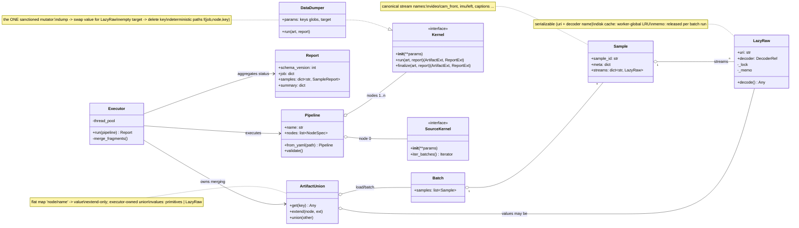
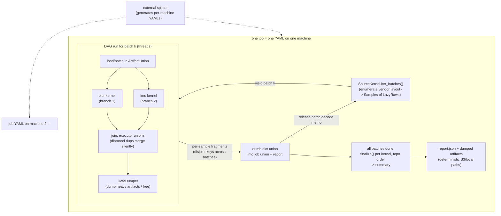
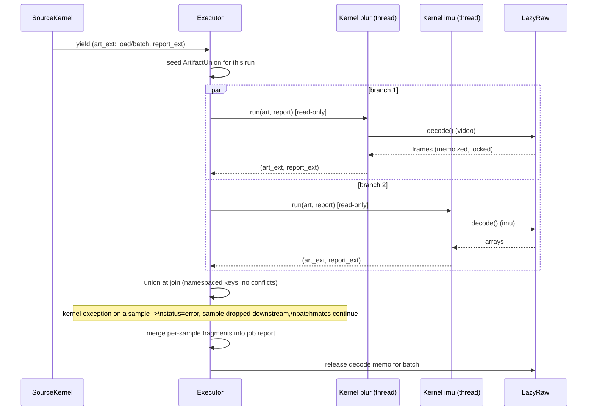
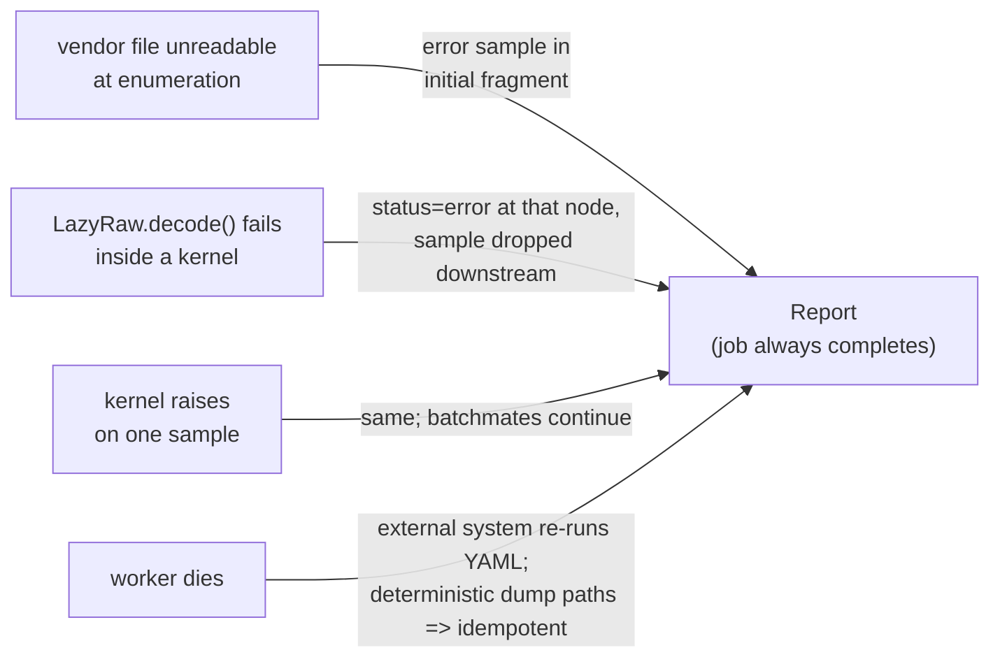

# Ego_QA — Architecture Diagrams

Mermaid sources; render in VS Code (Markdown Preview Mermaid extension) or GitHub.

## 1. Class diagram — core abstractions

## 2. Execution flow — per-batch streaming + terminal finalize

## 3. Sequence — one batch through the executor

## 4. Failsafe layers

