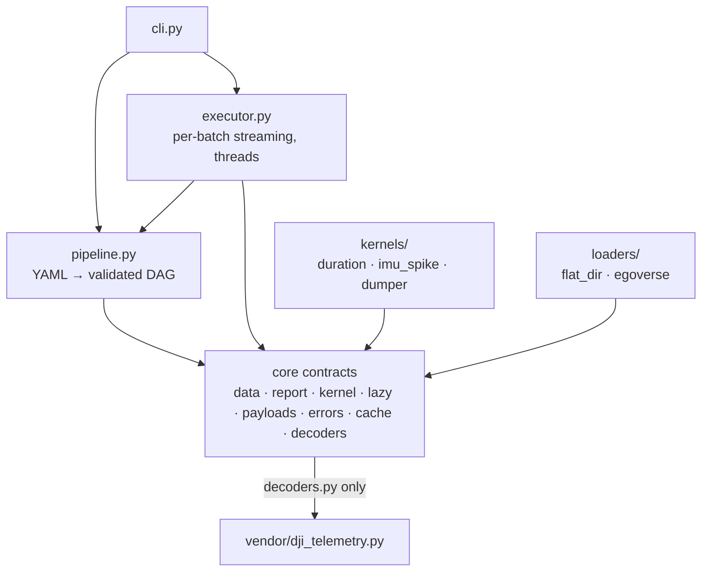
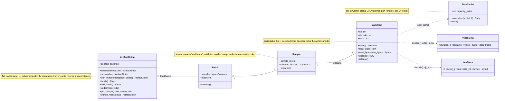
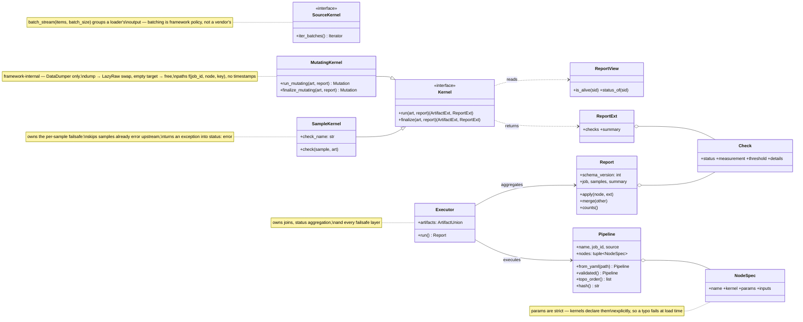
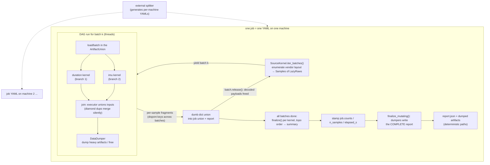
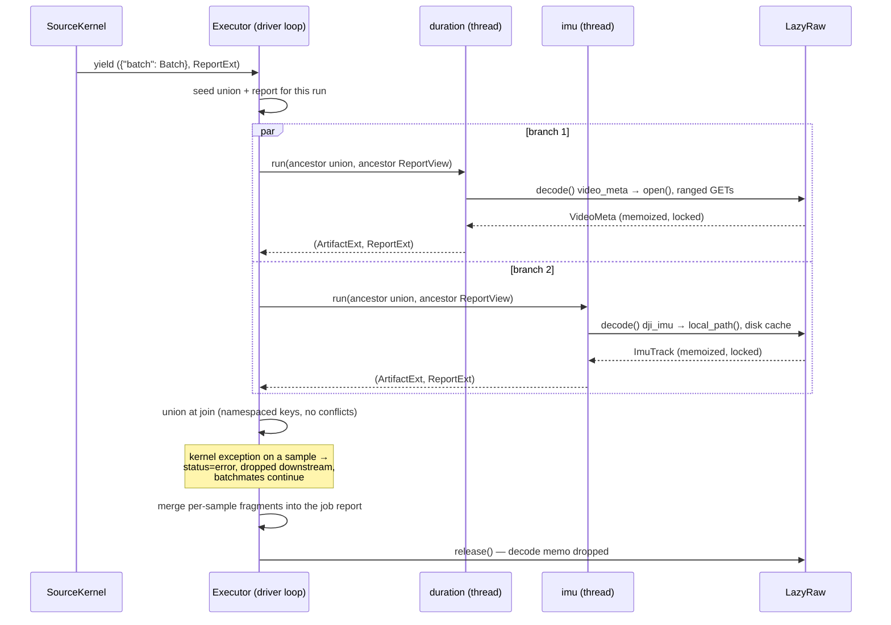
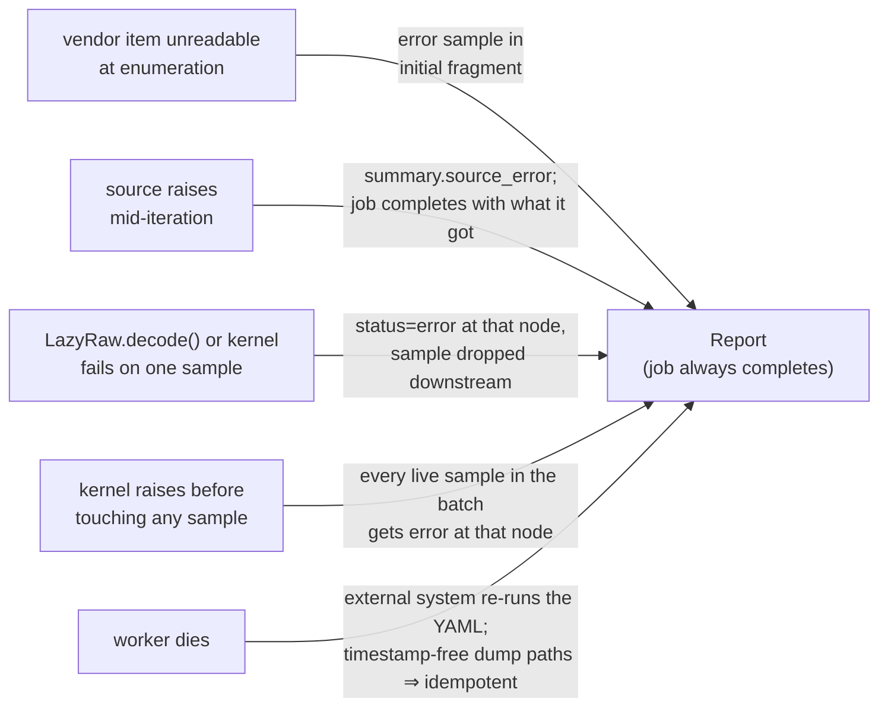

# AbaSift — architecture diagrams (mermaid source)

Rendered visual version: **[index.html](index.html)** — open it in a browser (styles and page
script are local files under [assets/](assets/); no CDN, no build step). This file is the text
source for the same architecture; keep the two in step when the design changes. Mermaid renders in VS Code (Markdown Preview Mermaid) or GitHub.

## 1. Module layers — imports point one way

Kernels and loaders depend on the core and nothing else — never on the executor, never on each
other. Vendor format knowledge is a leaf, reached only through a registered decoder.

## 2. Data plane — what flows through the DAG

## 3. Control plane — kernels, pipeline, report

## 4. Execution flow — per-batch streaming + terminal finalize

A node's inputs are the union **and report** of its *ancestors*, never global state — so which
samples a node considers alive does not depend on thread scheduling.

## 5. Sequence — one batch through the executor

## 6. Failsafe layers

